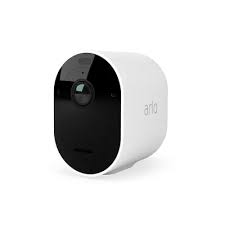

# Camera

This plugin is an add-on for the [A.V.A.T.A.R](https://avatar-home-automation.github.io/docs) framework.

🎯 Usage
Commandes :

affiche/lance/démarre/montre la camera,
ferme/éteins/stopela camera.

# Multi-room
The Camera plugin is fully multi-room.

# Multi-language
The Camera plugin relies solely on the system's available languages.

 <table style="border: none;">
  <tr>
    <td style="border: none;"></td>
    <td style="border: none;">
      <h1 style="margin: 0;color: brown;">Camera</h1>
      <h3 style="margin: 0;">Show Camera</h3>
    </td>
  </tr>
</table>
